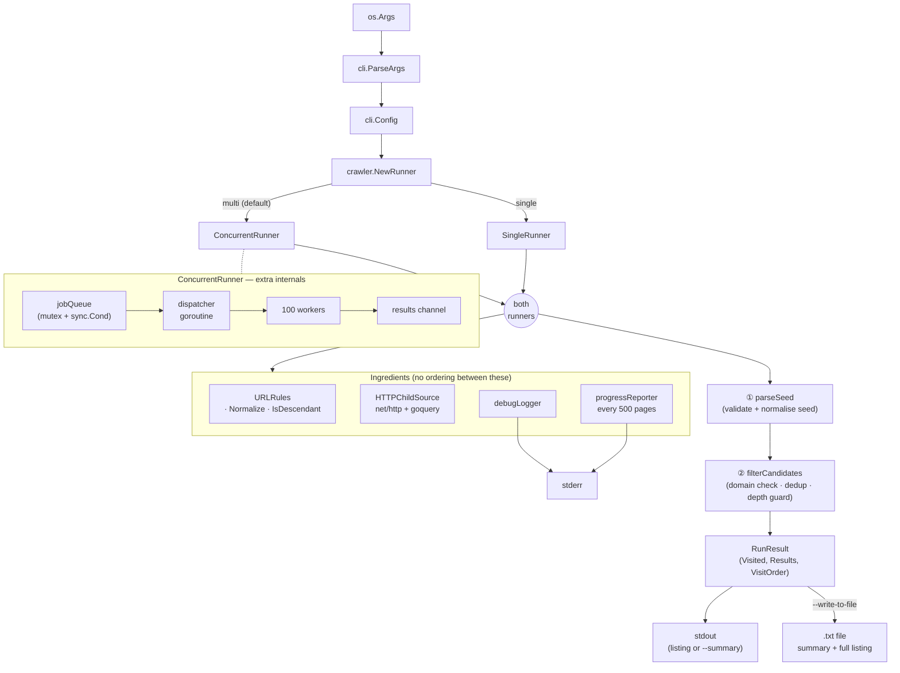

# monzo-scraper

A Go-based web crawler project with a clean, extendable structure.

## Prerequisites

- Go 1.25+ installed

## Setup

1. Clone the repository.
2. Open the project root.
3. Verify Go is available:

```bash
go version
```

## Run tests

```bash
go test ./...
```

## Run the CLI

```bash
go run . <seed-url> [max-depth] [--debug] [--summary] [--write-to-file] [--runner=<name>]
```

- `seed-url` (required): The initial URL to start crawling from.
- `max-depth` (optional): Positive integer crawl depth.
  - If omitted, crawling is treated as unlimited depth.
- `--debug` (optional): Enables verbose crawl diagnostics to help investigate slow runs.
- `--summary` (optional): Prints aggregate crawl metrics by depth instead of listing every page/link.
- `--write-to-file` (optional): Saves the crawl output to a `.txt` file in the current directory. The filename is derived from the seed URL and the crawl start time, e.g. `crawlme.monzo.com--2026-04-13--15-04-05.txt`.
- `--runner` (optional): Selects crawl runner implementation:
  - `multi` (default): concurrent traversal with up to 100 simultaneous page scrapes
  - `single`: single-threaded traversal

### Defaults and simple usage

If you pass **only a seed URL**, the tool:

- Crawls **only that host** (same scheme + host as the seed; other domains and subdomains are ignored).
- Uses **unlimited depth** (keeps following in-domain links until none remain).
- Uses the **`multi` runner** (up to 100 pages fetched in parallel).
- Prints **one page per block** to stdout: the visited URL, then the in-domain links found on that page.
- Does **not** enable `--debug`, `--summary`, or `--write-to-file`.

Minimal run:

```bash
go run . https://crawlme.monzo.com/
```

Add a depth limit as the second argument, and optional flags in any order after that, for example:

```bash
go run . https://crawlme.monzo.com/ 2 --summary
```

### Expected output

**Normal mode (default)** — stdout only, unless you use `--debug`:

1. Each **visited page** appears on its **own line** (normalized URL).
2. Underneath, each **in-domain link** discovered on that page is printed as an indented bullet (`  - ...`).
3. Order follows the crawl (breadth-first for both runners; `multi` may complete pages in a different completion order, but each page still lists its links consistently).

Example shape:

```text
https://crawlme.monzo.com/
  - https://crawlme.monzo.com/about
  - https://crawlme.monzo.com/blog
https://crawlme.monzo.com/about
  - https://crawlme.monzo.com/
```

**Summary mode** (`--summary`) — replaces the per-page listing with aggregate stats:

- Total pages found.
- Per **depth**: `found`, `scraped` (pages where the fetch succeeded), and **average scrape time** per page at that depth.
- **Overall totals**: `found`, `scraped`, **total_run_time** (wall-clock time for the whole crawl), and **avg_scrape_time** (mean of per-page fetch durations).

**Debug** (`--debug`) — diagnostic lines prefixed with `[debug]` are written to **stderr**, so they do not mix with the normal stdout listing.

### Examples

Run with unlimited depth:

```bash
go run . https://example.com
```

Run with a depth limit of 3:

```bash
go run . https://example.com 3
```

Run with debug output enabled:

```bash
go run . https://example.com --debug
```

Run in summary mode:

```bash
go run . https://example.com --summary
```

Run with the single-threaded runner instead of the default concurrent one:

```bash
go run . https://example.com --runner=single
```

Save output to a file:

```bash
go run . https://example.com --write-to-file
```

## Link Extraction Strategy (Initial)

Current child-link extraction uses `net/http` + `goquery` via an HTTP-backed `ChildSource`.

Limitations of this approach:

- It only sees links present in the raw HTML response.
- It does not execute JavaScript, so client-rendered links are not discovered.
- It does not perform browser interactions (clicks, form submission, infinite scroll, auth flows).

## Architecture


